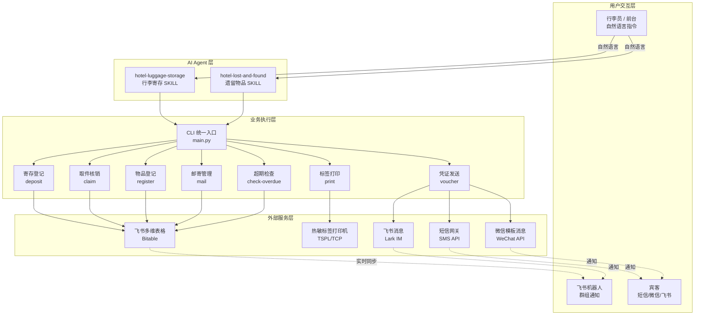

# 酒店服务套件 (Hotel Service Suite)

> 酒店行李寄存 & 遗留物品全流程管理系统，基于飞书多维表格 + AI Agent 的智能酒店服务解决方案。

## 项目概述

酒店服务套件为酒店前厅部、客房部提供一站式的行李寄存和遗留物品数字化管理能力。系统通过 AI Agent 接收自然语言指令，自动完成寄存登记、条码打印、电子凭证发送、取件核销、超期预警等全流程操作，大幅提升酒店服务效率和宾客体验。

### 核心特性

- **行李寄存全流程**：登记 → 打印 → 凭证 → 取件 → 核销，闭环管理
- **遗留物品全流程**：发现 → 登记 → 保管 → 通知 → 认领/邮寄 → 超期处置
- **三渠道通知**：飞书交互卡片 / 短信 / 微信模板消息
- **热敏标签打印**：TSPL 指令直连热敏打印机，含 Code128 条码
- **智能超期预警**：行李 24h/48h/72h 三级预警，遗留物品 30/60/90 天三阶段处置
- **飞书多维表格**：数据底座，支持多终端实时协同

## 系统架构



## 目录结构

```
hotel-service-suite/
├── main.py                              # CLI 统一入口
├── requirements.txt                     # Python 依赖
├── README.md                            # 项目文档
└── skills/
    ├── hotel-luggage-storage/
    │   └── SKILL.md                     # 行李寄存技能定义
    └── hotel-lost-and-found/
        └── SKILL.md                     # 遗留物品技能定义
```

## 数据底座

| 模块 | 飞书多维表格 app_token | table_id |
|------|----------------------|----------|
| 行李寄存 | `Atj6bOVJtaDGSjspKDqcx3Jqnfd` | `tblMPvX3VKodb80I` |
| 遗留物品 | `JJpTbxNJgaVojJsfUItcmvq5nqf` | `tblgcBcPR9P8fina` |

## 环境准备

### 前置依赖

- Python 3.9+
- [lark-cli](https://github.com/nicholaschenai/lark-cli) 已安装并完成飞书授权
- 热敏标签打印机（支持 TSPL 指令集，TCP/IP 连接）
- 短信网关 API 账号
- 微信公众号/小程序模板消息权限（可选）

### 安装步骤

```bash
# 1. 克隆项目
git clone <repo-url>
cd hotel-service-suite

# 2. 安装 Python 依赖
pip install -r requirements.txt

# 3. 验证 lark-cli 授权
lark-cli auth status

# 4. 测试多维表格连通性
lark-cli base +record-list \
  --app-token Atj6bOVJtaDGSjspKDqcx3Jqnfd \
  --table-id tblMPvX3VKodb80I \
  --page-size 1

# 5. 测试打印机连通性（替换为实际打印机 IP）
python -c "
import socket
s = socket.socket(socket.AF_INET, socket.SOCK_STREAM)
s.settimeout(5)
s.connect(('192.168.1.100', 9100))
print('打印机连接成功')
s.close()
"
```

## 使用指南

### 行李寄存

```bash
# 寄存登记
python main.py deposit \
  --guest "张三" \
  --room 1208 \
  --phone 13800138000 \
  --items 2 \
  --desc "黑色28寸行李箱1个，红色手提袋1个" \
  --type 普通行李 \
  --location 一楼行李房

# 打印条码标签
python main.py print \
  --number LG-20260623-001 \
  --printer 192.168.1.100

# 发送电子凭证（飞书）
python main.py voucher \
  --number LG-20260623-001 \
  --channel feishu

# 发送电子凭证（短信）
python main.py voucher \
  --number LG-20260623-001 \
  --channel sms

# 行李取件
python main.py claim \
  --number LG-20260623-001 \
  --code 8826

# 超期检查（24小时）
python main.py check-overdue \
  --type luggage \
  --hours 24
```

### 遗留物品

```bash
# 物品登记
python main.py register \
  --item "iPhone 15" \
  --category 电子产品 \
  --desc "黑色iPhone 15 Pro Max，带透明保护壳" \
  --finder "客房服务员小王" \
  --location 客房 \
  --room 302 \
  --guest "李四" \
  --phone 13900139000 \
  --important

# 打印物品标签
python main.py print \
  --number LF-20260623-001 \
  --printer 192.168.1.100

# 发送认领通知
python main.py voucher \
  --number LF-20260623-001 \
  --channel sms

# 邮寄物品
python main.py mail \
  --number LF-20260623-001 \
  --courier "顺丰" \
  --tracking "SF1234567890" \
  --address "北京市朝阳区xxx小区xxx号"

# 超期检查（30天）
python main.py check-overdue \
  --type lost-found \
  --days 30
```

## 编号规则

| 模块 | 编号格式 | 示例 | 说明 |
|------|----------|------|------|
| 行李寄存 | `LG-YYYYMMDD-XXX` | `LG-20260623-001` | LG = Luggage，XXX = 当日序号 |
| 遗留物品 | `LF-YYYYMMDD-XXX` | `LF-20260623-001` | LF = Lost & Found，XXX = 当日序号 |

## 超期预警规则

### 行李寄存（小时级）

| 级别 | 阈值 | 通知对象 | 通知方式 |
|------|------|----------|----------|
| 一级 | 24 小时 | 行李员 + 前台主管 | 飞书群消息 |
| 二级 | 48 小时 | 前台主管 + 客房经理 | 飞书群消息 + 私聊 |
| 三级 | 72 小时 | 值班经理 + 安保主管 | 飞书 + 短信 |

### 遗留物品（天级）

| 阶段 | 阈值 | 处置动作 | 状态更新 |
|------|------|----------|----------|
| 提醒 | 30 天 | 最终提醒宾客 | 保持 `待认领` |
| 公示 | 60 天 | 进入无人认领公示 | `无人认领报备` |
| 处理 | 90 天 | 移交公安 / 统一销毁 | `已移交公安` / `已销毁` |

## 通知渠道

| 渠道 | 适用场景 | 依赖 |
|------|----------|------|
| 飞书交互卡片 | 宾客关注酒店飞书机器人 | 飞书开放平台应用 |
| 短信 | 通用场景，确保送达 | 短信网关 API |
| 微信模板消息 | 宾客关注酒店微信公众号 | 微信公众号/小程序 |

## 打印机配置

系统支持 TSPL 指令集的热敏标签打印机（如 TSC TTP-244 Pro、佳博 GP-1324D），通过 TCP/IP 连接：

| 参数 | 行李寄存标签 | 遗留物品标签 |
|------|-------------|-------------|
| 标签尺寸 | 60mm x 40mm | 50mm x 30mm |
| 条码类型 | Code128 | Code128 |
| 通信方式 | TCP/IP 端口 9100 | TCP/IP 端口 9100 |

## 市场销售技能 (Market Sales Skills)

> 2026-06-25 新增：酒店客户开发工单系统 + 销售外拓追踪设计

### hotel-client-dev (客户开发工单生成器) v1.1

**SKILL 文件**: [skills/hotel-client-dev/SKILL.md](skills/hotel-client-dev/SKILL.md)

酒店客户开发全流程AI赋能工具。从企查查API获取企业数据→AI评分分级(P0-P3)→生成7模块开发工单→智能派单→飞书任务工单。

**三大开发维度**：
- **存量深挖**: 央国企生态链穿透（中海油系/中远海运系/中交系）
- **会务市场**: 会务公司签约→批量甲方客户
- **增量新拓**: 企查查全量扫描→AI评分→精准出击

**四大行业拓展维度** (v1.1新增):
- **银行/金融**: 滨海新区银行分支机构、证券、保险、基金
- **学校/医院**: 高校学术会议、医院专家来访、医药代表差旅
- **IT/科技**: 技术沙龙、驻场开发、AI智能酒店体验
- **新质生产力/央国企研究院**: 研发经费充裕、学术会议密集

**地域可达性修正**: 解决"总部在市区vs分支在滨海"的评分偏差

**国际方法论融合**: MEDDPICC(8维销售认证) + SPIN(提问序列) + Challenger Sale(教学式销售)

### hotel-outreach-tracker (销售外拓追踪) v1.0

**SKILL 文件**: [skills/hotel-outreach-tracker/SKILL.md](skills/hotel-outreach-tracker/SKILL.md)

销售外拓每日追踪系统设计文档。替代"管人型"外拓台账，升级为"AI赋能型"外拓系统。

## 文档 (Documentation)

| 文档 | 说明 |
|------|------|
| [P0客户开发工单](docs/P0客户开发工单.md) | 4家P0核心客户详细开发工单（渤海银行/天津港/中海油服/中远海运） |
| [SKILL复盘与市场研究](docs/skill_review_and_market_research.md) | SKILL工厂复盘 + 国际销售方法论 + MICE框架 |

## OpenClaw 一键部署

### 方式一：ClawHub 安装（推荐）

```bash
clawhub install hotel-client-dev
clawhub install hotel-outreach-tracker
clawhub install hotel-luggage-storage
clawhub install hotel-lost-and-found
```

### 方式二：手动部署

```bash
git clone https://github.com/Chaoliuzhu/hotel-service-suite.git
cp -r hotel-service-suite/skills/hotel-client-dev ~/.openclaw/workspace/skills/
openclaw reload
```

### 方式三：QoderWork / WorkBuddy

```bash
# QoderWork
cp -r skills/hotel-client-dev ~/.qoderwork/skills/

# WorkBuddy
cp -r skills/hotel-client-dev ~/.workbuddy/skills/
```

## 依赖环境

| 依赖 | 用途 | 安装 |
|------|------|------|
| lark-cli | 飞书多维表格/消息/任务 | `npm install -g @anthropic/lark-cli` |
| qcc-company MCP | 企查查API企业数据 | MCP配置 |
| Python 3.9+ | 数据处理/脚本 | `brew install python` |
| TSPL打印机 | 热敏标签打印 | TCP/IP 9100端口 |

## 飞书多维表格 Base

| 表格 | 用途 | 链接 |
|------|------|------|
| 生产外拓管理 | 客户拜访/销售指标/客户档案/潜在客户池/竞品监测/询价管理 | [打开](https://delonix.feishu.cn/base/SPhwbqRSVaLLKGsDgfOccBISnad) |
| 共享池 | 技能工具库/经验思路库/任务看板 | [打开](https://delonix.feishu.cn/base/ZJ8obBGrSaO9rjsXPvhc1TdYngd) |
| 询价管理 | 询价跟踪/AI赋能字段/转化漏斗 | [打开](https://delonix.feishu.cn/base/Tkx8bX0Z6antJJs12fycVoAZnUd) |

## 版本历史

- v1.1 (2026-06-25): hotel-client-dev 新增行业维度+地域可达性+MEDDPICC融合
- v1.0 (2026-06-24): hotel-client-dev 初版 + hotel-outreach-tracker 设计文档
- v0.9 (2026-06-23): hotel-luggage-storage v2.0 + hotel-lost-and-found v2.0

## 目录结构

```
hotel-service-suite/
├── main.py                              # CLI 统一入口
├── requirements.txt                     # Python 依赖
├── README.md                            # 项目文档
├── docs/
│   ├── P0客户开发工单.md                  # P0客户详细开发工单
│   └── skill_review_and_market_research.md # SKILL复盘与市场研究
└── skills/
    ├── hotel-client-dev/
    │   └── SKILL.md                     # 客户开发工单生成器 v1.1
    ├── hotel-outreach-tracker/
    │   └── SKILL.md                     # 销售外拓追踪 v1.0
    ├── hotel-luggage-storage/
    │   └── SKILL.md                     # 行李寄存管理 v2.0
    └── hotel-lost-and-found/
        └── SKILL.md                     # 遗留物品管理 v2.0
```

## 许可证

本项目为德胧集团酒店内部使用及AI龙虾军团协作研发。
